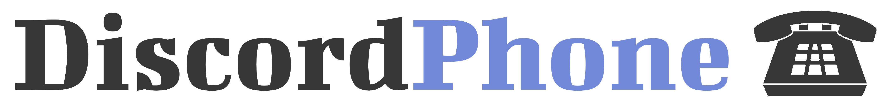

<p align="center"><a href="https://github.com/DiscordPhone/DiscordPhone" target="_blank" rel="noopener noreferrer"></a></p>

<p align="center">
    <a href="https://github.com/DiscordPhone/DiscordPhone/releases"></a>
    <a href="https://github.com/DiscordPhone/DiscordPhone/stargazers"></a>
    <a href="https://github.com/DiscordPhone/DiscordPhone/graphs/contributors"></a>
    <a href="https://github.com/DiscordPhone/DiscordPhone/blob/master/LICENSE"></a>
    <a href="https://discord.gg/REDACTED"></a>
</p>

This Discord bot will let you call phone numbers directly from Discord, and allow you to specify a custom caller ID.

For installation instructions without Docker, click [here](INSTALL.md).

---
## Usage
Remember to set environment variables in `.env` before building.
```bash
git clone git@github.com:DiscordPhone/DiscordPhone.git
cd DiscordPhone
mv .env.tmpl .env
sudo docker build .
sudo docker run <image-id>
```

---
## TODO
- [ ] Fix audio lag in DiscordPhone/softphone repo.
- [ ] Fix bot dying because of library already existing error when left idle for x minutes. 
- [ ] Fix static frame size (3840) in AudioCB - only works with 48000 hz sample rate at the moment.
- [ ] Add SMS support.
- [ ] Add a separate Mixer class for multiple speakers that can be used with sinks.
- [x] Create working Dockerfile.
- [ ] Clean up Dockerfile.
- [ ] Clean up DiscordPhone.py and use decorators for commands..?
- [ ] Add voice changer.
- [ ] Clean up the code.
- [ ] Write documentation for all functions.

---
## Disclaimer / ToS
The users of DiscordPhone accept unlimited liability for any risks they undertake, and upon use confirm that the developers of DiscordPhone should not be held responsible for the user's actions.
